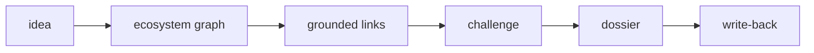

# scopegraph

An AI scoping runtime for projects that don't exist in isolation.

**Status:** design public, MVP in progress — W1 foundations complete (schema, seed data, graph service, tests).

---

## The product in five lines

*I describe a project. scopegraph finds the existing context.
It shows the links. It challenges the need. It generates a contextualized scoping dossier.*

---

## Why this project exists

scopegraph is the successor of **MAS**, a multi-agent system that turned fuzzy needs into structured
project proposals. MAS overlapped with `use-case-assistant` (vague business AI idea → structured
intake form), looking like a more complex version of the same thing. More fundamentally: classic scoping assistants
treat every project as if it arrived alone. In banking IT a new project inherits constraints from past
decisions, depends on existing systems, and competes with parallel initiatives. That propagation is
invisible to any tool that only asks "what's your goal and who are the users?". It surfaces later, as
incidents or rework.

scopegraph drops the spec-filler framing and solves that gap: context-aware scoping for non-independent
projects. Full pivot story: [docs/adr/0000-pivot-from-mas.md](docs/adr/0000-pivot-from-mas.md).

**Portfolio narrative:** `use-case-assistant` captures the need → `scopegraph` scopes it within
everything that already exists → (roadmap) `ecosystem-foundry` builds the ecosystem graph from
documents. Three links, zero redundancy.

---

## How it works

Six steps from fuzzy idea to grounded dossier:

1. User describes a fuzzy project idea (one sentence is enough).
2. scopegraph searches the ecosystem graph (semantic + domain-overlap boost).
3. It retrieves related systems, past projects, decisions, and constraints.
4. It identifies dependencies, risks, and inherited constraints — every claim grounded in a node ID.
5. It challenges the need, stating what the project actually is and what it inherits.
6. It produces a contextualized scoping dossier and a Context Map. On validation, write-back into the graph.



---

## The ecosystem graph

The graph has **7 node types** (System, Feature, BusinessObject, Project, Decision, Constraint, Risk)
and **7 edge types** (PART_OF, OPERATES_ON, DEPENDS_ON, CONSTRAINS, PRODUCED, SUPERSEDES,
RELATES_TO). The schema is defined at the Feature/BusinessObject grain, not the application grain.

A shared business rule is defined once as a single `Constraint` node. Its `CONSTRAINS` edges are
drawn to every `BusinessObject` it applies to. Every `Feature` that `OPERATES_ON` that object
inherits the constraint automatically — including features built after the constraint was defined,
and across applications that have no direct edge to each other. For example: a 48h cooling-off
period on credit products is one `Constraint` node attached to the `credit-contract`
`BusinessObject`; every application that operates on that object inherits it without a
direct application-to-application edge.

The schema is domain-agnostic: node and edge types contain nothing banking-specific. Only
`graph/domains.yaml` and the seed content are environment-specific. Porting scopegraph to a
different IT estate means swapping those two; zero schema-code change. See
[docs/adr/0001-graph-schema-v1.md](docs/adr/0001-graph-schema-v1.md) for the full topology rules.

The ecosystem registry is seeded. The seed contains **72 fictional French banking-IT nodes**
across 10 domains, **100 edges**, and **7 deliberate traps** (system aliases, contradictory
decisions, a superseded decision, a 2-hop cross-domain propagation chain). All entities are
fictional; ingestion from documents is the roadmap (see ecosystem-foundry).

---

## The demo scenario

Input: *"We want to add a 'pay in 3 installments' option (BNPL) to the mobile banking app."*

A naive assistant asks about goals, users, and expected gains — and scopes it as an isolated
mobile feature.

scopegraph retrieves from the seed graph and grounds every finding in node IDs:

- The card authorization engine (`monetique` domain) and the decision *"all new payment flows must
  reuse the SCA orchestration from the DSP2 program"* → inherited dependency, not optional.
- The fraud-scoring engine and the decision *"fraud scoring is the single decision point for
  payment risk"* → the BNPL eligibility check cannot ship its own parallel scoring.
- The `credit` domain → installment payment is legally a credit product, pulling in credit-domain
  regulation the mobile team never thinks about.
- The TPE acceptance software (2 hops away via `monetique`) and the decision *"TPE software updates
  are quarterly, no out-of-band releases"* → if in-store BNPL is in scope, that quarterly-release
  decision is a hard scheduling constraint.

The challenge statement:

> *"This should not be scoped as a mobile feature. It is a credit product riding on the monétique
> stack: it inherits SCA orchestration, the single fraud-scoring decision point, credit-domain
> regulation, and — if in-store acceptance is in scope — the TPE quarterly release constraint.
> Scope and owners must reflect that."*

**The killer move:** scope a second project right after. Write-back means it "sees" the first one —
the graph grows through usage.

---

## What keeps it honest

- **Grounding gate.** Every claim must cite an existing node ID; the runtime rejects ungrounded claims
  visibly, never silently. Rejections appear in the UI — they are a demo feature, not a silent failure.
- **Runtime authority.** The LLM proposes; the runtime decides. All state transitions go through a
  deterministic state machine. The LLM never mutates the source of truth.
- **Human validation.** Propose → validate → apply for every significant step: links into the
  dossier, write-back into the graph.
- **Hermetic tests.** No API key, no network, no model download. `MockProvider` and `FakeEmbedder`
  stand in for all LLM and embedding calls. A test that calls a real provider is a bug.

---

## Language note

Demo, seed data, dossiers, and the application UI are in **French** — this is the French banking
domain, and authenticity matters. The demo challenge statement above is rendered in French in the
actual application.

Code, comments, docstrings, README, and ADRs are in **English**.

---

## Getting started

```bash
python3 -m venv .venv
.venv/bin/pip install -e ".[dev]"

# Run the test suite (no API key or network required)
.venv/bin/python -m pytest

# Explore active docs with "read when" hints
./scripts/docs-list
```

---

## Roadmap

| Week | Deliverables |
|------|--------------|
| **W1 — done** | ADRs · Pydantic schema + loader + GraphService · seed data (72 nodes, 100 edges) · README · eval cases drafted |
| **W2** | Embedder + ChromaDB indexing · hybrid retrieval (semantic + domain boost + 2-hop traversal) · first web screens (chat pane + live Context Map) |
| **W3** | LLM providers (Mistral, DeepSeek, Mock) · grounding gate · propose/validate/apply ledger · challenge + scoping questions |
| **W4** | Dossier renderer · Context Map polish · write-back · scripted BNPL demo (incl. second scoping that sees the first) · eval run |
| **ecosystem-foundry** | Separate repo: graph built from unstructured documents — entity extraction, resolution, adversarial edge verification. Output conforms to schema v1; plugging into scopegraph is trivial by construction. |
