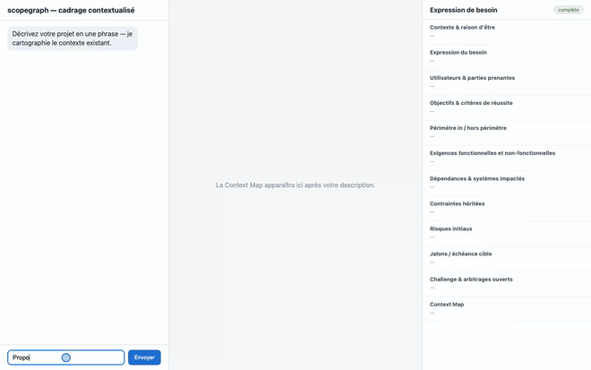
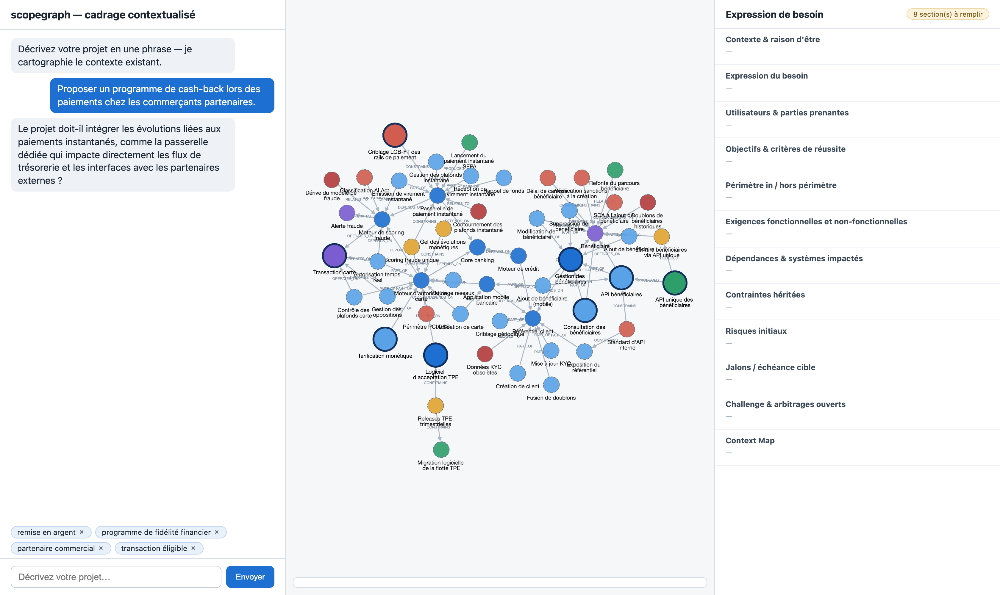
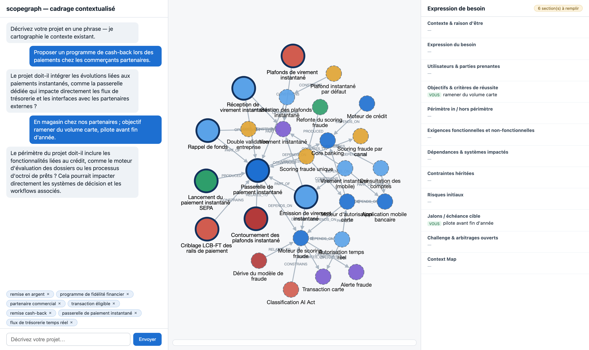
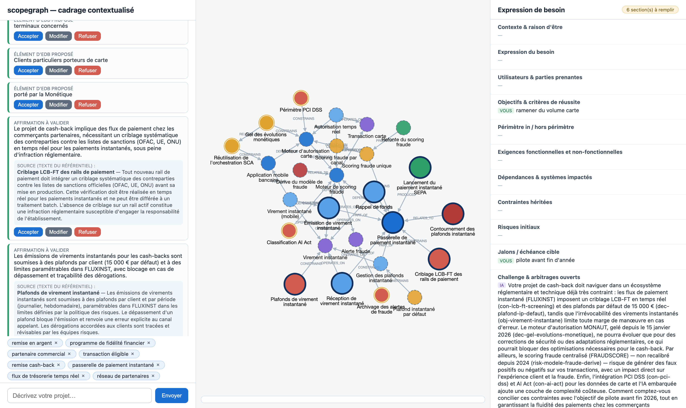
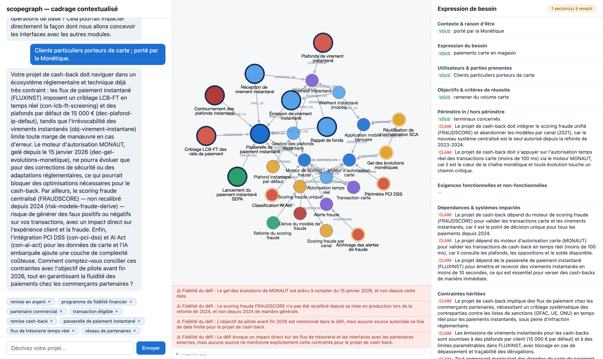
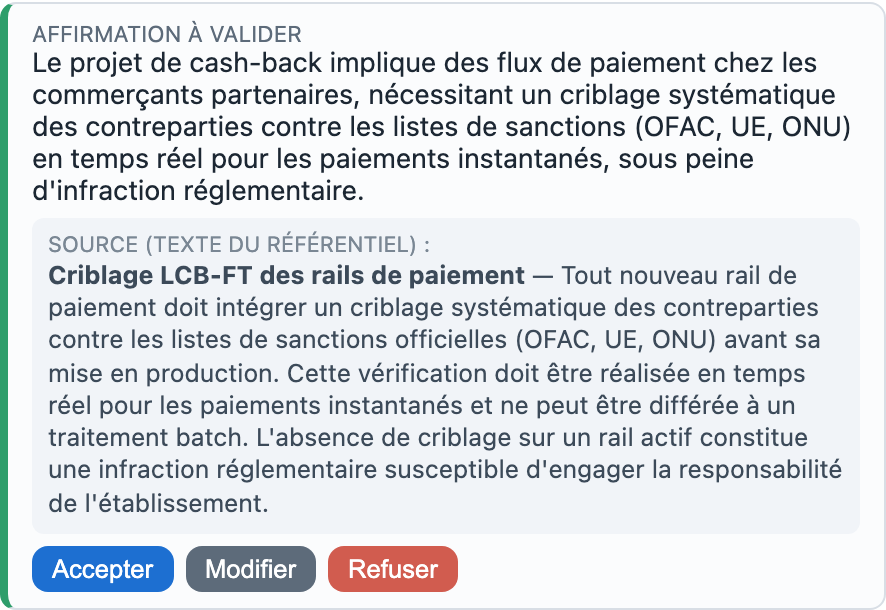
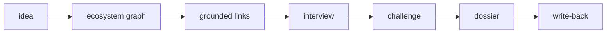

<div align="center">

# scopegraph

**An AI scoping runtime for projects that don't exist in isolation.**
It maps a new project against the IT estate it will inherit — dependencies, past
decisions, inherited constraints, parallel initiatives — and **challenges the need**
with findings that each cite a real node in the graph.

[](https://github.com/LoicLang/scopegraph/actions/workflows/ci.yml)
[](LICENSE)
[](pyproject.toml)
[](tests)

</div>

> **Status — W1→W3 built and benched.** The ecosystem graph, the hybrid retrieval, the
> deterministic interview, and the full **LLM challenge layer** (grounded claims +
> governance pull + fidelity guards) work end-to-end across three models. W4 (dossier
> render, write-back, formal eval run) is next. 234 hermetic tests, CI green.

---

## Why I built it

Every scoping tool I've met treats a project as if it arrived alone: *what's your goal,
who are the users, what's the budget?* In a real IT estate — a bank's especially — a new
project inherits constraints from decisions made years ago, depends on systems nobody on
the team has heard of, and collides with initiatives running in parallel. That
propagation is invisible to a form. It surfaces later, as an incident or a rebuild.

scopegraph makes it visible up front. You describe a project in one sentence; it walks
the graph of what already exists, conducts a short context-aware interview, then
**challenges the framing** — stating what the project really is and what it inherits,
with every constraint and risk grounded in an existing node. The LLM proposes; a
deterministic runtime decides, and rejects anything ungrounded *visibly*. The point is
not a smarter form. It is to move the hidden, expensive context to the front of the
conversation, where it is cheap.

Full pivot story (from a multi-agent predecessor): [docs/adr/0000-pivot-from-mas.md](docs/adr/0000-pivot-from-mas.md).

---

## See it work

A real session of the live app (Mistral), driven end-to-end by
[`tools/screenshots/record.mjs`](tools/screenshots/record.mjs) — one sentence in, and the
**Context Map, the interview, and the dossier build themselves**.

<p align="center">
  
</p>

> One sentence → the map builds itself → a free answer fills the dossier → the challenge
> fires, and every claim carries its **verbatim source from the graph**.
> &nbsp;[▶ full video](assets/demo.mp4)

The stills, step by step:

<p align="center">
  
  
</p>

> **Left:** one sentence ("a cash-back programme at partner merchants"), and the map is
> already populated — anchors, expansions, and a woven question that mentions the actual
> systems at stake. **Right:** a free answer is mined into dossier entries on the fly.

<p align="center">
  
  
</p>

> **Left:** the challenge — the map shrinks to what's justified and each claim ships the
> **authoritative text of the node it cites**. **Right:** the dossier, filled with
> grounded entries (every `CLAIM` badge is traceable to a real node).

<p align="center">
  
</p>

> One claim card: the model's reasoning on top, the **verbatim source from the graph**
> below — so you check the paraphrase against the truth — and the human in control
> (*Accepter / Modifier / Refuser*). The runtime rejects anything it can't ground.

---

## How it works



1. The user describes a fuzzy project idea (one sentence is enough).
2. scopegraph searches the ecosystem graph — semantic anchors + domain-overlap boost +
   bounded 1–2 hop expansion with edge-path provenance.
3. A deterministic **interview** resolves the ambiguities the graph exposes (which
   domains are in scope?) and fills a 12-section dossier — graph questions and discovery
   questions interleaved, never an interrogation.
4. When the map stabilizes, the **challenge** runs: the LLM triages the over-complete
   subgraph, a deterministic *governance pull* brings back the linked decisions/risks, and
   the LLM states the case — every claim citing node IDs, every figure checked.
5. The user accepts or rejects each proposed claim and dossier entry.
6. (Roadmap) On validation, the scoping writes back into the graph — so the *next*
   project sees this one.

---

## The challenge layer — what makes it different

Retrieval is deliberately recall-first: it returns an over-complete map. **Precision is
the job of the challenge layer**, and it is where the runtime keeps the LLM honest:

- **Two-phase, gated.** Gate A: the LLM triages each retrieved node (keep / reject, with a
  reason); missing verdicts default to *keep* (recall-first). A deterministic **governance
  pull** then walks one hop from the kept nodes along `CONSTRAINS`/`SUPERSEDES` edges to
  bring back the decisions, constraints and risks they inherit. Gate B: every claim the LLM
  makes must cite a node that is actually on the stabilized map, target an allowed dossier
  section, and carry a reason — anything else is **rejected visibly**, not silently.
- **Claims ship their proof.** Each claim card carries the *authoritative text* of the
  nodes it cites, straight from the graph — so the reader verifies the model's paraphrase
  against the source, not the other way round.
- **Statement fidelity.** A deterministic guard flags any number/percentage in the
  free-prose challenge that is absent from the cited sources (catching invented
  statistics); an optional LLM pass flags semantic drift.
- **It degrades to nothing gracefully.** `SCOPEGRAPH_LLM_PROVIDER=none` runs the whole
  product on deterministic templates — no key, no network. The LLM is polish on a floor
  that always holds.

---

## The ecosystem graph

**7 node types** (System, Feature, BusinessObject, Project, Decision, Constraint, Risk)
and **7 edge types** (PART_OF, OPERATES_ON, DEPENDS_ON, CONSTRAINS, PRODUCED, SUPERSEDES,
RELATES_TO), defined at the Feature/BusinessObject grain, not the application grain.

A shared business rule is one `Constraint` node. Its `CONSTRAINS` edges reach every
`BusinessObject` it applies to; every `Feature` that `OPERATES_ON` that object inherits it
automatically — including features built after the rule, across applications with no direct
edge to each other. The 48-hour cooling-off on new payees is a single node on
`obj-beneficiaire`; the beneficiary app and the mobile app both inherit it, with no
application-to-application edge.

The schema is **domain-agnostic** — node and edge types contain nothing banking-specific.
Only `graph/domains.yaml` and the seed content are environment-specific; porting to a
different estate swaps those two, zero schema-code change. Topology rules:
[docs/adr/0001-graph-schema-v1.md](docs/adr/0001-graph-schema-v1.md).

The seed is **72 fictional French banking-IT nodes** across 10 domains, **100 edges**, and
**7 deliberate traps**: aliases, contradictory decisions, a superseded decision, a 2-hop
cross-domain propagation chain, constraint inheritance through a shared object, non-uniform
documentation depth, and a cancelled project that must surface as a *warning*, not a
constraint. All entities are fictional; ingestion from documents is the roadmap.

---

## The demo scenario

Input: *"We want to add a 'pay in 3 installments' option (BNPL) to the mobile banking app."*

A naive assistant asks about goals, users and gains, and scopes it as an isolated mobile
feature. scopegraph grounds every finding in node IDs:

- the card authorization engine + *"all new payment flows must reuse the DSP2 SCA
  orchestration"* → an inherited dependency, not optional;
- the single fraud-scoring decision point → the BNPL eligibility check cannot ship its own
  parallel scoring;
- the `credit` domain → an installment plan is legally a credit product, pulling in
  regulation the mobile team never thinks about;
- the TPE acceptance software, **2 hops away**, + *"TPE updates are quarterly, no
  out-of-band releases"* → a hard scheduling constraint if in-store BNPL is in scope.

> *"This should not be scoped as a mobile feature. It is a credit product riding on the
> monétique stack: it inherits SCA orchestration, the single fraud-scoring decision point,
> credit-domain regulation, and — if in-store acceptance is in scope — the TPE quarterly
> release constraint. Scope and owners must reflect that."*

**The killer move:** scope a second project right after. Write-back means it *sees* the
first — the graph grows through usage.

---

## How it's tested

Two layers, by design — because *correctness* and *quality* are different questions.

**The mechanics are proven hermetically.** 234 tests, no API key, no network, no model
download: `MockProvider` and `FakeEmbedder` stand in for every LLM and embedding call, and
a test that reaches a real provider is itself a bug. They pin the deterministic core — the
grounding gates, the governance pull (traversal, cap, provenance), the EDB state machine,
the propose/validate ledger, the JSON-contract retry, the interview's question selection and
fallbacks. This is what guarantees the `provider=none` floor — the whole product running on
templates — always holds. CI runs them on every push.

**The quality is measured against real models, never asserted.** Determinism doesn't make
the LLM's *judgement* good; only real models can show that. Three out-of-CI harnesses replay
over a disk cache so re-runs are free, and every finding lands in
[docs/known-limits.md](docs/known-limits.md) with its evidence and its honest limits.

- **`scripts/retrieval-eval`** — retrieval quality over 11 hand-derived scenarios (recall,
  map size, precision), with a distractor-stress sweep up to 2000 nodes.
- **`scripts/challenge-eval`** — the challenge end-to-end. It delivers the precision stage it
  was designed for: mean map **60 → 11.5 nodes**, precision **13% → 53%**, **0 ungrounded
  claims** survive the gate.
- **`scripts/conversation-eval`** — an LLM *persona* plays a project manager and is scoped by
  the real session across DeepSeek, Mistral and Grok. It earned its keep immediately: it
  caught a production crash (two models omit a required claim field), a statement dict-leak,
  and the limits of a model judging its own output.

The conclusions come from the benches, not the hermetic suite: the tests prove the runtime is
deterministic; the benches say whether the result is any good — recall-vs-scale, the
vocabulary bridge, retrieval drift under conversation — all written down, none hidden.

---

## Language note

Seed data, dossiers, prompts and the app UI are **French** — this is the French banking
domain, and authenticity matters. Code, comments, docstrings, README and ADRs are
**English**.

---

## Getting started

```bash
python3 -m venv .venv
.venv/bin/pip install -e ".[dev]"

# Run the test suite — no API key, no network, no model download
.venv/bin/python -m pytest

# Run the app. Template mode works with zero config:
.venv/bin/pip install -e ".[embeddings,llm]"
.venv/bin/uvicorn --factory web.app:create_app          # SCOPEGRAPH_LLM_PROVIDER defaults to none
```

To add the LLM polish, copy `.env.example` to `.env` and set a provider + key
(`mistral` | `deepseek` | `grok`). The real environment always wins over the file.

---

## Roadmap

| Phase | Status | Deliverables |
|---|---|---|
| **W1 — foundations** | ✅ done | ADRs · Pydantic schema + fail-fast loader + GraphService · seed (72 nodes, 100 edges, 7 traps) · interactive graph viewer |
| **W2 — retrieval + map** | ✅ done | Qwen3 embedder + Chroma index · hybrid retrieval (semantic + domain boost + 2-hop) · MAPPING interview · chat + live Context Map |
| **W3 — LLM challenge layer** | ✅ done | Provider protocol (Mistral/DeepSeek/Grok/Mock) · 12-section dossier · two-phase challenge + governance pull · propose/validate ledger · claim provenance + statement fidelity · graph/gap interview · three-pane UI · challenge-eval + conversation-eval |
| **W4 — dossier + eval** | next | Dossier renderer · Context Map polish · graph write-back · scripted BNPL demo (incl. the second scoping that sees the first) · formal eval run |
| **ecosystem-foundry** | roadmap | Separate repo: graph built from unstructured documents (extraction, resolution, adversarial edge verification). Output conforms to schema v1 by construction. |
